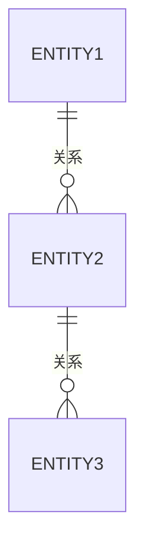
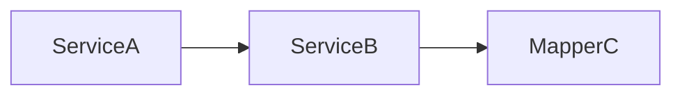

# {业务领域} 代码地图

> 尽量精简，不要记录代码中显而易见的信息（属性名、方法名、详细逻辑）。

## 代码清单

- {名称}：
  - 摘要：{代码内容摘要}
  - 代码：{所属模块}/.../{文件名/目录名}

## 实体关系

{使用 mermaid 或文字描述核心实体及其关系，不要画出字段属性}

比如：

## 调用关系

{类和类之间的调用关系，注重谁使用了谁，而不是具体函数方法的调用链}

比如：

## API 清单

- {接口名称}
  - 摘要：{API功能摘要}
  - {接口方法} {接口path}
  - 代码：{所属模块}/.../{文件名/目录名}
