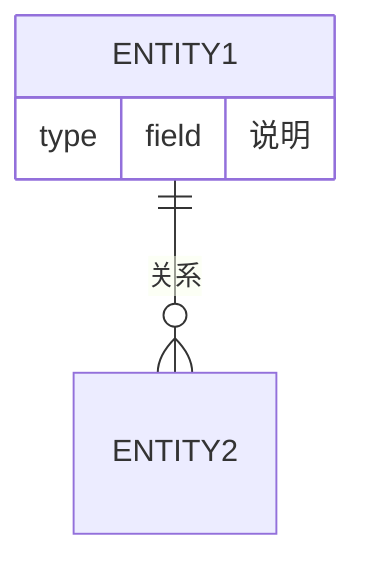

# {业务领域} 代码地图

> 尽量精简，不要记录代码中显而易见的信息（属性名、方法名、详细逻辑）。

## 代码清单

- {名称}：
  - 摘要：{代码内容摘要}
  - 代码：[{文件名/目录名}]({路径})

## 实体关系

{使用 mermaid 或文字描述核心实体及其关系}

## 调用关系

{关键调用链路}

## API 清单

- {接口名称}
  - 摘要：{API功能摘要}
  - {接口方法} {接口path}
  - 代码：[{文件名/目录名}]({路径})
