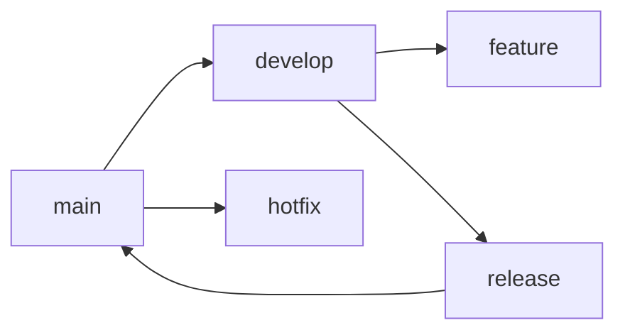

# Git 规范

## 分支规范

{分支模型，如 Git Flow、GitHub Flow 等。以下以 Git Flow 为例}



## Commit 规范

{Commit message 格式，如 Conventional Commits}

```
<type>(<scope>): <subject>

<body>

<footer>
```

Type 取值: `feat`, `fix`, `docs`, `style`, `refactor`, `test`, `chore`

## 合并规范

{PR/MR 流程、Rebase vs Merge 策略}

## 标签规范

{版本号标签格式}
