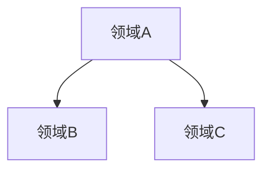

# 项目概述

## 项目背景

{项目背景和目标}

## 业务名词

{该项目的通用语言（Ubiquitous Language），只写 AI 需要知道的特殊名词}

- **{名词}**：{定义}

## 领域清单

{列出所有业务领域，每个领域一句话摘要}

- **{领域名}**：
  - 关键词：{关键词}
  - 摘要：{领域摘要}

## 领域关系图

{使用 mermaid 描述领域之间的关系}

