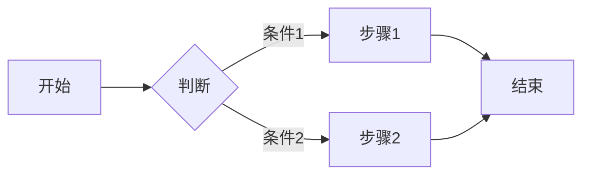

# {业务领域} 需求文档

## 概述

{简要描述该业务领域的目标和范围}

## 边界上下文（Bounded Context）

{描述该领域的边界，包含和不包含什么}

## 核心概念

{该领域的关键业务名词和术语（Ubiquitous Language）}

- **{名词}**：{定义}
- **{名词}**：{定义}

## 业务规则

{该领域的核心业务规则和约束}

## 业务流程

{使用 mermaid 描述关键业务流程}

## 领域关系

{描述该领域与其他领域的关系，使用 mermaid}

## API 概览

{该领域对外暴露的主要 API 或接口}

## 数据模型

{核心实体及其关系}

## 非功能性需求

{性能、安全性、可用性等方面的要求}
