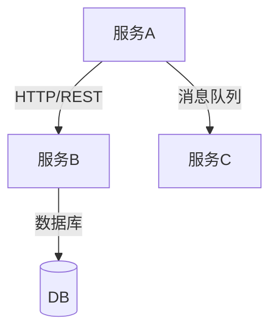
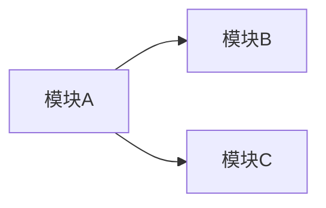

# 技术架构

## 技术栈

### 开发语言

{如: Java 17, TypeScript 5.0}

### 重要依赖

{只列重要的、对架构有影响的依赖}

- **{依赖}**（v{版本}）：{用途}

## 微服务清单

- **{服务名}**：
  - 摘要：{微服务功能摘要}
  - 技术栈：{技术栈}

## 模块清单

- **{模块名}**：
  - 摘要：{模块功能摘要}
  - 所属服务：{所属服务}

## 服务关系

{使用 mermaid 描述微服务之间的关系}

## 模块关系

{使用 mermaid 描述模块之间的依赖关系}

## 关键技术决策

{记录重要的技术选型决策和原因}

- **{决策}**：选择 {选择}（而非 {选项}），因为 {原因}
